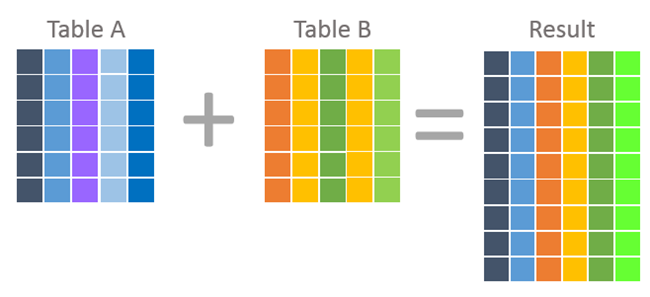
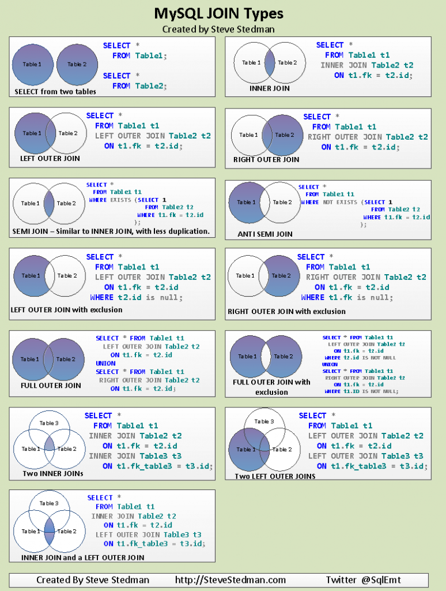
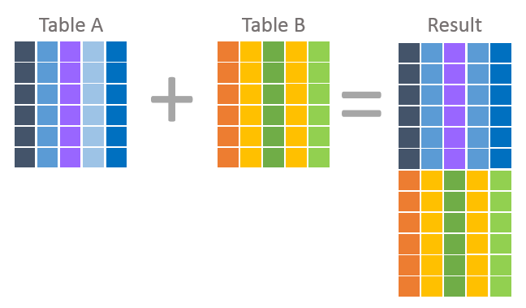

## Joins, Unions, etc.

#### References

* [Join](https://www.w3schools.com/sql/sql_join.asp)
* [Union](https://www.w3schools.com/sql/sql_union.asp)
* [Subquery](https://www.mysqltutorial.org/mysql-subquery/)


### Joins vs. Sub-query

```sql
# Join - select from table1, join table2 on guid, where condition in table2

SELECT COUNT(*) FROM table1
JOIN table2 ON table1.guid = table2.guid
WHERE table2.tester = 1;

# Sub-query - select from table1, where *IN* table2 with where condition

SELECT COUNT(table1.guid) FROM table1
WHERE table1.guid IN (SELECT guid FROM table2 WHERE tester = 1);

# multiple selects and conditions

SELECT * FROM table1 t1, table2 t2, table3 t3 
WHERE t1.id = t2.t1id AND t2.id = t3.t2id


```


## Joins



```sql

# join - joins combine data into new columns from one or more TABLES using a cartesian product

SELECT * FROM 
  (SELECT 23 AS bah) AS foo 
JOIN 
  (SELECT 45 AS bah) AS bar
ON (33=33);
+-----+-----+
| foo | bar |
+-----+-----+
|  23 |  45 | 
+-----+-----+

# select all users who have an "a" in their username AND have a score > 5000
SELECT * FROM 
  (SELECT guid, username, score FROM users WHERE username LIKE "%a%") AS u1 
INNER JOIN 
  (SELECT guid, username, score FROM users WHERE score > 5000) AS u2 
ON (u1.guid = u2.guid);

```


```sql
# THESE ARE THE SAME

SELECT t1.*, t2.* FROM table1 t1
JOIN table2 t2 ON t1.guid = t2.guid
WHERE t2.tester = 1;

SELECT t1.*, t2.* FROM table1 t1
LEFT OUTER JOIN table2 t2 ON t1.guid = t2.guid
WHERE t2.tester = 1;
```


```sql
# Three table join example

SELECT * FROM table1 t1
LEFT JOIN table2 t2 ON t2.t1id = t1.id
LEFT JOIN table3 t3 ON t2.guid = t3.guid
WHERE t3.tester = 1;

```


```sql
# update one column in a table with data from the same table

UPDATE consumables t1 
JOIN consumables t2 ON t1.id = t2.id
SET t1.slug = CONCAT(t2.name, "-", t2.type) WHERE t1.id = 371;

```





## Union



```sql

# union - combine data into new rows from one or more TABLES using two or more select statements

SELECT 23 AS bah 
UNION
SELECT 45 AS bah;
+-----+
| bah |
+-----+
|  23 | 
|  45 | 
+-----+

# select condition from a union, with union all to allow duplicate values 

SELECT * FROM
(
  SELECT type, name FROM attacks as a
  UNION ALL
  SELECT type, name FROM badges as b
) result
WHERE createdAt = "2020-07-01"
ORDER BY createdAt DESC; 


```


